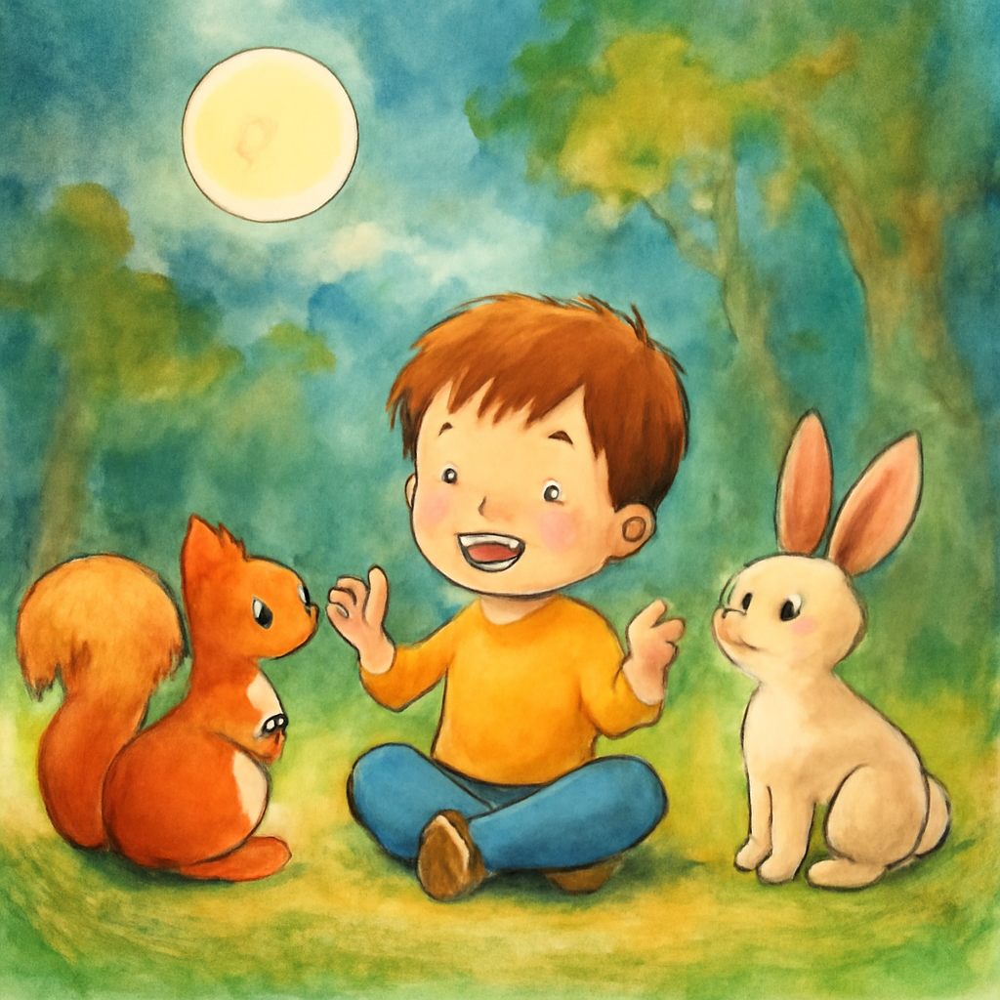
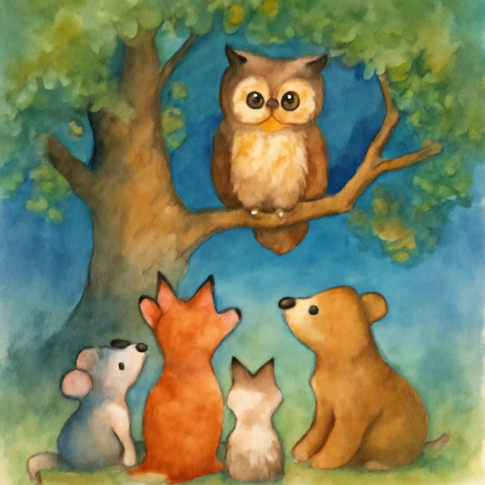

# 어린이 동화책 만들기 — Workflow Agent 파이프라인 (Google ADK)

테마를 입력하면 Workflow Agent들이 협업해 **5페이지 동화 + 페이지별 삽화**를 만듭니다.

## 기술 스택

| 구분 | 사용 기술 |
|---|---|
| Agent Framework | Google **Agent Development Kit (ADK)** — `SequentialAgent`, `ParallelAgent`, 커스텀 `BaseAgent` |
| 텍스트 생성 LLM | **OpenAI GPT-4o** (`openai/gpt-4o`), **LiteLLM** 을 통해 ADK와 연동 |
| 이미지 생성 모델 | **OpenAI `gpt-image-1`** (base64 응답, `dall-e-3` 로 교체 가능) |
| 데이터 검증 | **Pydantic** (`StoryBook` / `StoryPage` 스키마) |
| 패키지 관리 | **uv** |
| 실행/테스트 환경 | **ADK Web UI** (`adk web`), 커스텀 데모 스크립트 (`demo.py`) |
| 상태 공유 | ADK **Session State** (`output_key`, `ctx.session.state`) |
| 결과물 저장 | ADK **Artifact Service** (`page_1.png ~ page_5.png`) |

## 파이프라인 구조

```
[사용자 입력: 테마]
        ↓
SequentialAgent (storybook_pipeline)        ← 전체 흐름 관리
        ↓
  1) story_writer (LlmAgent)                 5페이지 동화 작성 → state["story_data"]
        ↓
  2) parallel_illustrator (ParallelAgent)    5개 삽화를 동시에 생성 → Artifacts
        ├── page_illustrator_1  ┐
        ├── page_illustrator_2  │  (커스텀 BaseAgent, 병렬 실행)
        ├── page_illustrator_3  │
        ├── page_illustrator_4  │
        └── page_illustrator_5  ┘
        ↓
  3) book_presenter (커스텀 BaseAgent)        제목 + 5페이지(Text/Visual/Image) 최종 출력
```

## 요구사항 매핑

| 요구사항 | 구현 |
|---|---|
| **SequentialAgent** 로 흐름 관리 | `root_agent = SequentialAgent([story_writer, parallel_illustrator, book_presenter])` |
| **ParallelAgent** 로 이미지 동시 생성 | `parallel_illustrator = ParallelAgent(sub_agents=[PageIllustratorAgent(i) for i in range(5)])` |
| **Callbacks** 로 진행 상황 표시 | `before/after_agent_callback` 이 "스토리 작성 중...", "이미지 N/5 생성 중..." 출력 |
| 최종 출력(텍스트+이미지) | `book_presenter` 가 동화 전문 + 삽화 파일명을 출력, 이미지는 Artifacts 탭 |
| Agent State 공유 | writer 가 `output_key="story_data"` 로 저장 → 각 페이지 에이전트가 `ctx.session.state` 로 읽음 |
| 2가지 이상 테마 데모 | `demo.py` 가 서로 다른 두 테마를 순서대로 실행하고 결과를 저장 |

## 폴더 구조

```
storybook_project/       ← 여기서 `uv run adk web` 또는 `uv run demo.py` 실행
├── storybook/
│   ├── __init__.py
│   ├── agent.py         ← root_agent + 모든 에이전트/콜백 정의
│   └── .env             ← OPENAI_API_KEY (.env.example 복사)
├── demo.py              ← 2가지 테마를 자동 실행하는 데모
├── requirements.txt
└── README.md
```

## 설치 & 실행 (uv)

```bash
cd storybook_project

# 가상환경 생성 + 의존성 설치
uv venv
uv pip install -r requirements.txt

# API 키 설정
cp storybook/.env.example storybook/.env
#   storybook/.env 를 열어 OPENAI_API_KEY=sk-... 입력
```

### A) ADK Web UI 로 테스트

```bash
uv run adk web
```
`http://localhost:8000` → `storybook` 에이전트 선택 → 테마 입력(예: "보라색 하늘을 좋아하는 아기 토끼").
- 서버 콘솔에 콜백 진행 로그가 출력됩니다("📝 스토리 작성 중...", "🎨 이미지 3/5 생성 중..." 등).
- Events 패널에 각 페이지 완료 이벤트, State 탭에 `story_data`, Artifacts 탭에 `page_1.png ~ page_5.png`.

### B) 2가지 테마 데모 (산출물)

```bash
uv run demo.py
```
`THEMES` 리스트의 두 테마를 순서대로 실행하고, 결과 이미지를
`demo_output/theme_1/`, `demo_output/theme_2/` 에 저장합니다. 다른 테마로 바꾸려면
`demo.py` 상단의 `THEMES` 를 수정하세요.

## 데모 결과물

`uv run demo.py` 실행 후 생성되는 산출물 예시입니다.

### 테마 1 — "보라색 하늘을 좋아하는 아기 토끼"

```
📖 보라색 하늘을 좋아하는 아기 토끼

Page 1
Text: 아기 토끼 보니는 보라색 하늘을 정말 좋아했어요.
Visual: A small, fluffy bunny named Bonnie with soft, white fur ...
Image: page_1.png
...
```
| page_1.png | page_2.png | page_3.png |
|---|---|---|
|  |  |  |

### 테마 2 — "별을 모으러 떠난 작은 고양이"

```
📖 별을 모으러 떠난 작은 고양이

Page 1
Text: 작은 고양이 미미는 밤하늘을 좋아했어요.
Visual: A small, fluffy orange kitten with big, sparkling eyes ...
Image: page_1.png
...
```
| page_1.png | page_2.png | page_3.png |
|---|---|---|
|  |  |  |

> 위 표는 `uv run demo.py` 실행 후 생성되는 `demo_output/theme_1/`, `theme_2/` 폴더의
> 이미지를 그대로 마크다운 표에 넣은 예시입니다. 실제 실행 후 이미지 경로/개수(5장)에 맞게
> 채워 넣거나, `demo_output/theme_1/`, `theme_2/` 폴더의 `story.txt`를 그대로 붙여 넣으면 됩니다.

## 🎥 Demo Video

[Watch Demo](https://imgur.com/a/PPDPzAP)


## 참고

- 이미지 모델은 `agent.py` 의 `IMAGE_MODEL`(기본 `gpt-image-1`)에서 바꿀 수 있습니다.
  화질을 높이려면 `IMAGE_QUALITY` 를 `"medium"`/`"high"` 로 조정하세요(대신 느려집니다).
- 텍스트 모델은 LiteLLM 을 통한 OpenAI GPT-4o(`openai/gpt-4o`)입니다.
